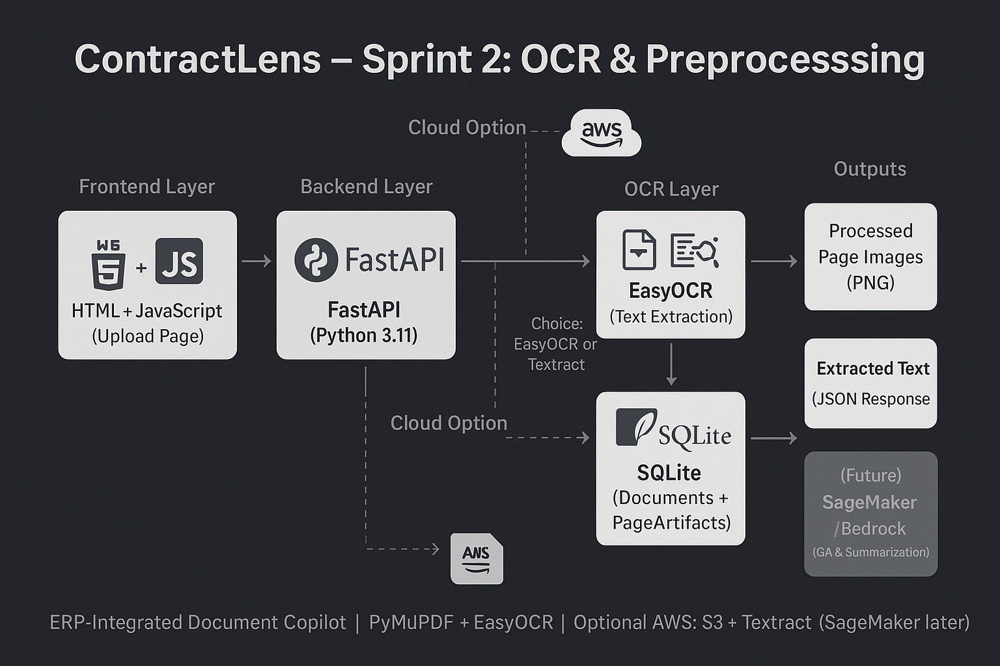

📑 ContractLens

ContractLens is an ERP-integrated document copilot that helps businesses manage contracts, invoices, and scanned documents more efficiently.
The project demonstrates an end-to-end pipeline: file ingestion → OCR → structured storage → document QA → summarization.

## System Architecture

## System Architecture

🚀 Project Roadmap (Sprints)

Sprint 1 (Setup & Upload) ✅

FastAPI backend with /upload endpoint.

Simple HTML upload page.

Uploaded files stored locally in data/uploads/.

✅ Sprint 2 – OCR & Preprocessing

Convert PDFs → images with PyMuPDF.

OCR with EasyOCR (supports multiple languages).

Store extracted text + metadata in SQLite using SQLAlchemy.

Added endpoints:

POST /upload → process PDF, run OCR, store text.

GET /document/{doc_id} → fetch full OCR text.

🔜 Sprint 3 – Document QA

Integrate Hugging Face Question-Answering model.

Ask structured questions (vendor, total, due date).

Highlight extracted answers on document previews.

🔜 Sprint 4 – Summarization & ERP Storage

Summarize long documents using BART / T5 models.

Store metadata + text for downstream ERP integration.

✅ Sprint 1 – Deliverables
Features

/health route to confirm server status

/upload endpoint for PDFs/images

Frontend form (index.html) with JS fetch() call

Unique file IDs generated → files saved under data/uploads/

Demo

Start the server:

uvicorn main:app --reload

Open http://127.0.0.1:8000/

Upload a file → server responds with JSON:

{
  "doc_id": "abcd1234",
  "original_filename": "Report.pdf",
  "saved_as": "data/uploads/abcd1234.pdf",
  "content_type": "application/pdf"
}

File appears in data/uploads/.

✅ Sprint 2 – Deliverables
Features

PDF → image conversion (PyMuPDF)

OCR using EasyOCR

SQLite database with documents and page_artifacts tables

/upload and /document/{doc_id} API routes

Auto-created folders:

data/uploads/ → original PDFs

processed/ → per-page PNGs

data/contractlens.db → SQLite database

Demo

Start the server:

uvicorn app.main:app --reload

Open http://127.0.0.1:8000/docs
 or your static upload page.
Upload a PDF → server returns OCR text preview.

🧠 Learnings

PyMuPDF gives fast, high-quality PDF → image conversion.

EasyOCR is simple to integrate for multilingual OCR.

SQLite via SQLAlchemy is perfect for quick local storage.

FastAPI dependency injection (Depends(get_db)) simplifies DB sessions.

🛠️ Tech Stack

Backend: FastAPI · Python 3.11 · Uvicorn
OCR: PyMuPDF · EasyOCR · Pillow
Database: SQLite · SQLAlchemy
Frontend: HTML + JavaScript (upload page)
Environment: venv + dotenv

⚙️ Installation & Setup
git clone https://github.com/PSSK-S/contractlens.git
cd contractlens

python -m venv .venv
.\.venv\Scripts\activate  # Windows
# source .venv/bin/activate  # Mac/Linux

pip install -r requirements.txt
uvicorn app.main:app --reload

📅 Next Steps

🔜 Sprint 3 → Document QA pipeline (Hugging Face).
🔜 Sprint 4 → Summarization + structured storage.

🤝 Contributing

Contributions, issues, and feature requests are welcome!
Feel free to open a PR or start a discussion in the issues tab.