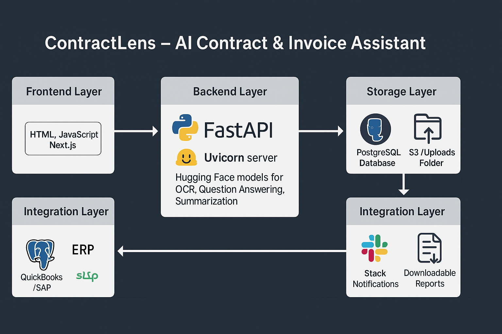
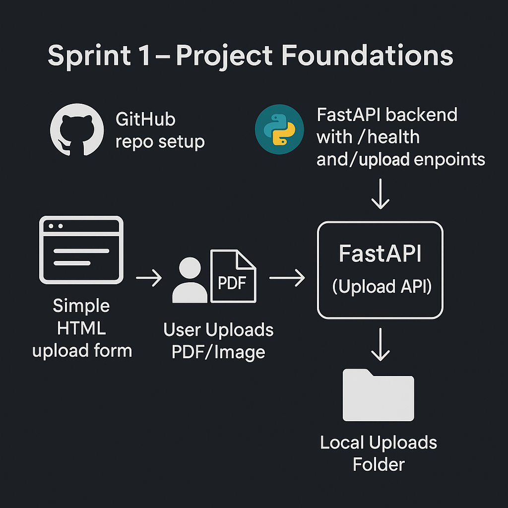

📑 ContractLens - ContractLens: AI-Powered Document Intelligence for ERP Systems

ContractLens is an ERP-integrated document copilot that helps businesses manage contracts, invoices, and scanned documents more efficiently.
The project demonstrates an end-to-end pipeline: file ingestion → OCR → structured storage → document QA → summarization.

## System Architecture

## System Architecture

🚀 Project Roadmap (Sprints)

Sprint 1 (Setup & Upload) ✅

FastAPI backend with /upload endpoint.

Simple HTML upload page.

Uploaded files stored locally in data/uploads/.

Sprint 2 (OCR & Preprocessing) ⏳

Convert PDFs → images with pdf2image.

OCR support via Tesseract/EasyOCR.

Save raw extracted text to database (SQLite/Postgres).

Sprint 3 (Document QA) 🔜

Integrate Hugging Face Document QA pipeline.

Answer key questions (vendor, total, due date).

Highlight bounding boxes on document previews.

Sprint 4 (Summarization & Storage) 🔜

Summarize long documents with Hugging Face models (BART/T5).

Store metadata + text in structured database for ERP integration.

✅ Sprint 1 – Deliverables
Features

/health route to confirm server status.

/upload endpoint for PDFs/images.

Frontend form (index.html) with JS fetch call.

Unique file IDs generated, files saved under data/uploads/.

Demo

Start the server:

uvicorn main:app --reload

Open http://127.0.0.1:8000/

Upload a file → server responds with JSON:

{
  "doc_id": "abcd1234",
  "original_filename": "Report.pdf",
  "saved_as": "data/uploads/abcd1234.pdf",
  "content_type": "application/pdf"
}

File appears in data/uploads/.

🛠️ Tech Stack

Python 3.11

FastAPI – modern web framework for APIs

Uvicorn – ASGI server for FastAPI

HTML + JavaScript – basic frontend upload form

venv – Python virtual environment isolation

⚙️ Installation & Setup

Clone the repo:

git clone https://github.com/<your-username>/contractlens.git
cd contractlens

Create and activate a virtual environment:

python3 -m venv venv
source venv/bin/activate   # Mac/Linux
venv\Scripts\activate      # Windows

Install dependencies:

pip install -r requirements.txt

Run the server:

uvicorn main:app --reload

📌 Learnings (Sprint 1)

FastAPI vs Uvicorn → framework vs server.

venv vs Docker → Python sandbox vs full container.

Debugging 405 errors (method mismatch, static vs API mounts).

📅 Next Steps

🔜 Sprint 2 → OCR and text extraction.

🔜 Sprint 3 → Document QA pipeline.

🔜 Sprint 4 → Summarization + structured storage.

🤝 Contributing

Contributions, issues, and feature requests are welcome.
Feel free to open a pull request or suggest ideas in the issues tab.

